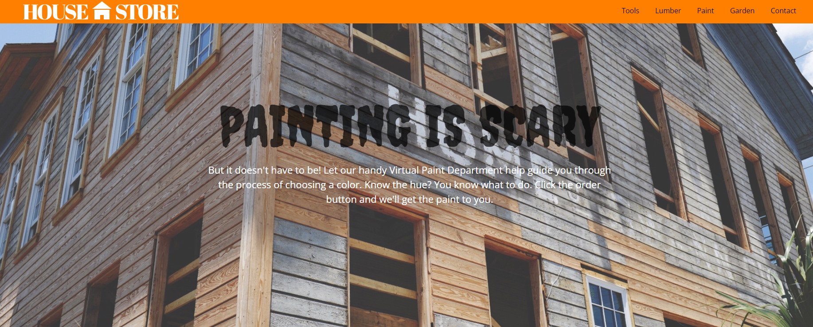

# Paint-Store
A responsive webpage for a paint store, featuring a header with navigation, a banner, a color guide with red, green, and blue swatches, and a footer with an order button. The design uses CSS for styling and layout, with media queries for mobile and tablet compatibility.

## Deployment
[Paint-Store](https://austinslatey.github.io/paint-store/)

## Screenshots

## Features
-Responsive Design: Adapts to screen sizes using media queries (breakpoints at 990px, 820px, 590px, 560px, and 540px).

- Color Guide: Displays red, green, and blue swatches with variations in hue, saturation, and lightness.

- Custom Styling: Uses Google Fonts ("Creepster" and "Open Sans") and a consistent color scheme with an orange accent (#ff8000).

- Interactive Elements: Includes a navigation menu and a call-to-action button in the footer.

## Setup
- Clone the repository
  `git clone <repository-url>`
- Open index.html in a web browser to view the page.
